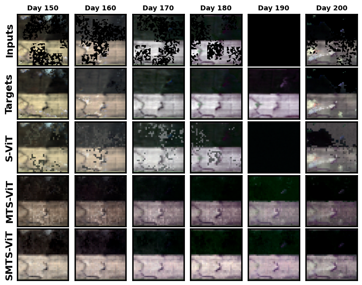
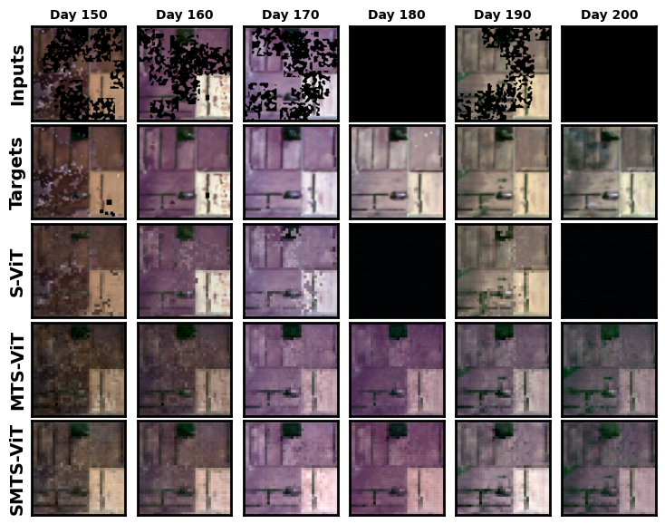

# SMTS-VIT

This repository serves as a platform for showcasing supplementary visual outcomes and preliminary mapping experimental findings derived from our Vision Transformer (ViT)-based models.
## Additional Visual Results

Partial occlusion experiments were conducted with one day fully covered by cloud, as illustrated in [Figure 1](#figure-1). Specifically, we fully occluded the fifth input image to simulate scenarios where certain regions are entirely obstructed. Using our SMTS-ViT, we observed that the model successfully inferred the missing image's texture, color, and other details, even in the presence of cloud interference across the remaining inputs. In contrast, we found that S-ViT, lacking temporal sequence information, could only rely on random guessing. Its output images were significantly affected by the cloud occlusions, particularly on day 170, where it started generating arbitrary predictions rather than logically filling in based on spatial-temperal information. Furthermore, the reconstructed colors exhibited substantial distortion. On the other hand, SMTS-ViT demonstrated a clear advantage over MTS-ViT in terms of detail restoration and color consistency, as evident in the comparative results for days 170 and 190. This directly validates the necessity of leveraging multichannel data and highlights the superiority of our method over non-temporal sequence ViT models, especially under scenarios involving cloud-induced occlusions. 

<figure style="text-align: center;">
  
  <figcaption id="figure-1">Figure 1: Additional Results for Scenarios with One Day Fully Obscured by Cloud Coverage (# Cloud = 10)</figcaption>
</figure>

Furthermore, experiments were also conducted with two days of coverage, where inputs from two days were occluded. It can be observed that our SMTS-ViT still manages to predict the missing regions' textures relatively accurately, as shown in [Figure 2](#figure-2). Although the model exhibits slight color distortion, it successfully reconstructs the texture details and captures the temporal trends in color variation,

<figure style="text-align: center;">
  
  <figcaption id="figure-2">Figure 2: Additional Results for Scenarios with Two Days Fully Obscured by Cloud Coverage (# Cloud = 10)</figcaption>
</figure>

## Early Crop Mapping Experiments

The following table presents the experimental results when our model is used as a pre-trained model and further fine-tuned for crop mapping tasks. OA refers to overall accuracy. All classifiers were trained for 40 epochs with a learning rate of 1e-4.

| Model    | \#Cloud | OA (AVG)↑ Val 2020 | OA (AVG)↑ Val 2021 | F1 Score (AVG)↑ Val 2020 | F1 Score (AVG)↑ Val 2021 |
|----------|---------|--------------------|--------------------|--------------------------|--------------------------|
| S-ViT    | 0       | 0.786              | 0.594              | 0.753                    | 0.514                    |
|          | 20      | 0.780              | 0.583              | 0.724                    | 0.493                    |
|          | 30      | 0.780              | 0.582              | 0.723                    | 0.490                    |
|          | 40      | 0.780              | 0.585              | 0.722                    | 0.490                    |
| MTS-ViT  | 0       | 0.906              | 0.659              | 0.896                    | 0.647                    |
|          | 20      | 0.847              | 0.648              | 0.831                    | 0.632                    |
|          | 30      | 0.839              | 0.638              | 0.813                    | 0.617                    |
|          | 40      | 0.820              | 0.619              | 0.792                    | 0.599                    |
| SMTS-ViT | 0       | **0.935**          | 0.657              | 0.932                    | 0.659                    |
|          | 20      | 0.862              | 0.617              | 0.852                    | 0.616                    |
|          | 30      | 0.852              | 0.611              | 0.839                    | 0.607                    |
|          | 40      | **0.838**          | 0.607              | 0.819                    | 0.602                    |
| S-ViT    | AVG     | 0.782              | 0.586              | 0.731                    | 0.497                    |
| MTS-ViT  | AVG     | 0.853              | **0.641**          | 0.833                    | **0.624**                |
| SMTS-ViT | AVG     | **0.872**          | 0.623              | **0.860**                | 0.621                    |

The potential application of restoring heavily cloud-covered images lies in crop mapping. By utilizing our restoration network, it is feasible to freeze its parameters and concatenate an additional classifier, transforming the model into an efficient crop mapping classifier. This approach leverages the model’s deep understanding of time-series crop image reconstruction and its spatial attention mechanism. To explore the potential of such a pre-trained model in transfer learning for crop mapping classification, we designed an experiment to evaluate its effectiveness. This also serves as a demonstration of the potential efficiency of transformer-based models in similar tasks. The structure of our classifier is outlined as follows.

The classifier consists of a series of convolutional layers with increasing depth (64 to 512 channels), each followed by batch normalization and ReLU activation. A dropout layer is included to prevent overfitting, and a final convolutional layer outputs class probabilities using softmax, enabling effective image classification with robust feature extraction and spatial attention. Throughout the training process, we froze the parameters of the reconstruction model and used cross-entropy loss as the objective function. The definition of the cross-entropy loss is as follows:

$$ \mathcal{L_{CR}} = -\frac{1}{N \times H \times W} \sum_{i=1}^{N} \sum_{h=1}^{H} \sum_{w=1}^{W} \sum_{c=1}^{C} y_{i,h,w,c} \log(\hat{y}_{i,h,w,c}), $$

where:
-  $N$ is the number of images in the batch,
-  $H$ and $W$ are the height and width of the image,
-  $C$ is the number of classes (or channels for multi-class segmentation),
- $y_{i,h,w,c}$ is the true label for the pixel $(h, w)$ in image $i$ and class $c$,
- $\hat{y}_{i,h,w,c}$ is the predicted probability for the pixel $(h, w)$ in image $i$ and class $c$.

Additionally, overall Accuracy and F1 Score were used as metrics to evaluate the efficiency of the crop mapping process. As shown in Table \ref{tab:table results cropmapping}, it can be observed that the model, SMTS-ViT, demonstrates the best classification performance, particularly in the absence of cloud interference, with an accuracy of **93.5%**. In comparison, MTS-ViT reaches an accuracy of **90.6%**. However, these models exhibit poor generalization on the 2021 dataset due to a cross-domain issue. This occurs because the distribution of data for the same target crop varies across different regions or years. Since the model was trained exclusively on the 2020 dataset, it became overfitted to that specific distribution. However, SMTS-ViT achieved better classification accuracy for the 2021 dataset, with an OA of 0.623 and an F1 Score of 0.621, outperforming other methods. A better OA of 0.641 and F1 Score of 0.624 on the 2021 validation set for MTS-ViT are observed due to overfitting. However, in reconstruction tasks, SMTS-ViT still demonstrates a notable performance advantage.

One solution to improve generalization is to train the model on data from multiple years, which is expected to significantly enhance its performance. This experiment clearly highlights the potential of our time-series ViT model for crop mapping, laying the foundation for further applications of this architecture. In the future, we can also explore cross-domain research in crop mapping, fully utilizing the potential of ViT models.